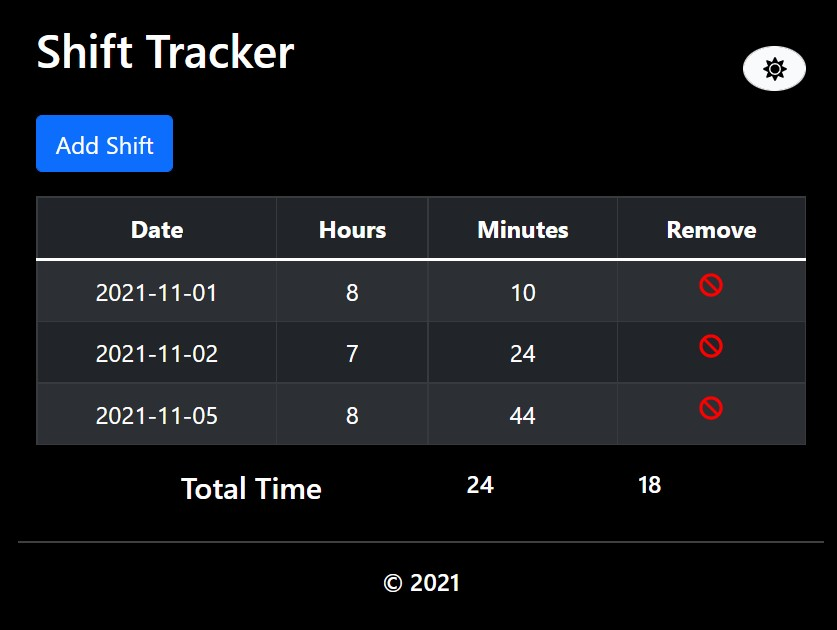

# Shift tracker
An app designed to keep track of hours worked each month



## Why?
I wanted to create something for personal use to keep track of work hours.

## Todos
- Add ability to edit shifts
- Create database
- Create user login
- Create separate months folders

## Run
Clone the repository, then...
```bash
# Install
$ npm install
# Run the json-server first at port 5000
$ npm run server
# Start up the react app at port 3000
$ npm start
```

## Use
Click the **Add Shift** button.
Select a date from the calendar, input the hours and minutes worked on said date, then click the **Submit** button.